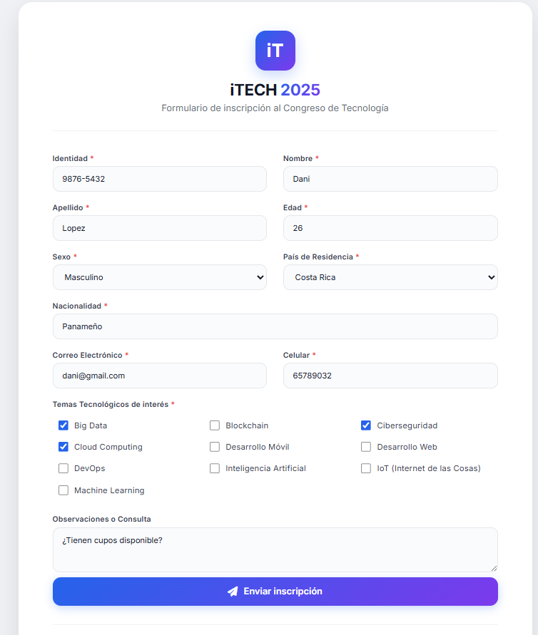
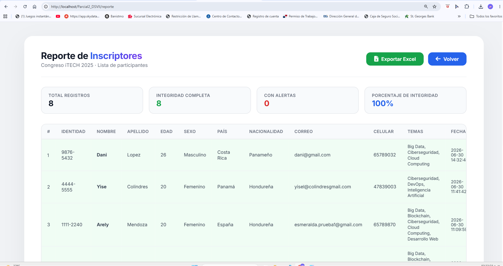

📄 README.md (COMPLETO Y PROFESIONAL)
markdown
# iTECH 2025 - Sistema de Inscripción
## Parcial2 - Arely Mendoza

> Sistema de inscripción para el Congreso de Tecnología iTECH 2025 desarrollado con PHP y MySQL bajo el patrón MVC.

---

## Tabla de Contenidos

- [Descripción](#descripción)
- [Características](#características)
- [Tecnologías Utilizadas](#tecnologías-utilizadas)
- [Estructura del Proyecto](#estructura-del-proyecto)
- [Requisitos](#requisitos)
- [Instalación](#instalación)
- [Base de Datos](#base-de-datos)
- [Uso](#uso)
- [Capturas de Pantalla](#capturas-de-pantalla)
- [Autores](#autores)
- [Licencia](#licencia)

---

##  Descripción

**iTECH 2025** es un sistema web de inscripción para el Congreso de Tecnología. Permite a los usuarios registrarse, seleccionar áreas de interés tecnológico y visualizar un reporte con todos los participantes. El sistema implementa validaciones de datos, sanitización, auditoría de integridad y exportación a Excel.

### Objetivo

Gestionar de manera eficiente las inscripciones al congreso iTECH 2025, garantizando la integridad de los datos y brindando una experiencia de usuario profesional.

---

##  Características

### Seguridad y Validación
- **Sanitización de datos** - Clase estática que limpia todas las entradas
- **Validación en PHP** - Verificación de todos los campos del formulario
- **Data Cleaning** - Nombres y apellidos en formato título (mayúscula inicial)
- **Integridad de datos** - Auditoría visual ( verde /  rojo)

### Base de Datos
- **Estructura MVC** - Organización profesional de archivos
- **Llaves foráneas** - `ON DELETE RESTRICT` y `ON UPDATE CASCADE`
- **Restricciones UNIQUE** - Identidad y correo únicos
- **CHECK de edad** - Solo permite edades entre 18 y 120 años

### Reportes y Exportación
-  **Reporte de participantes** - Con temas separados por comas
- **Exportación a Excel** - Un clic para descargar todos los datos
- **Auditoría de integridad** - Indicadores visuales de calidad de datos
- **Estadísticas en tiempo real** - Total, integridad y porcentaje

###  Diseño
-  **UI Moderna** - Diseño profesional con gradientes y sombras
-  **Responsive** - Adaptable a todos los dispositivos
- x**Fuentes profesionales** - Google Fonts (Inter)
-  **Iconografía** - Font Awesome

---

## 🛠️ Tecnologías Utilizadas

| Tecnología | Versión | Descripción |
|------------|---------|-------------|
| **PHP** | 8.3.28 | Lenguaje de programación backend |
| **MySQL** | 8.4 | Sistema de gestión de bases de datos |
| **Apache** | 2.4.65 | Servidor web |
| **WAMP** | - | Entorno de desarrollo local |
| **PDO** | - | Conexión segura a base de datos |
| **HTML5** | - | Estructura de las vistas |
| **CSS3** | - | Estilos y diseño responsive |
| **JavaScript** | - | Interactividad básica |
| **Font Awesome** | 6.4.0 | Iconografía |
| **Google Fonts** | Inter | Tipografía profesional |

---

## Estructura del Proyecto
PARCIAL2_DSVII/
│
├── 📁 app/ # Código de la aplicación
│ ├── 📁 config/ # Configuración
│ │ └── 📄 database.php # Conexión a base de datos
│ │
│ ├── 📁 controllers/ # Controladores
│ │ └── 📄 InscriptorController.php # Controlador principal
│ │
│ ├── 📁 models/ # Modelos
│ │ ├── 📄 Inscriptor.php # Modelo de inscriptores
│ │ ├── 📄 Pais.php # Modelo de países
│ │ └── 📄 Tema.php # Modelo de temas
│ │
│ ├── 📁 utils/ # Utilidades
│ │ ├── 📄 Sanitizer.php # Limpieza de datos
│ │ └── 📄 Validator.php # Validación de datos
│ │
│ └── 📁 views/ # Vistas
│ ├── 📄 formulario.php # Formulario de inscripción
│ └── 📄 reporte.php # Reporte de participantes
│
├── 📁 public/ # Acceso público
│ └── 📄 index.php # Controlador frontal (Front Controller)
│
├── 📄 .htaccess # Reglas de reescritura de URL
├── 📄 index.php # Redirección a public/
├── 📄 parcial_itech.sql # Respaldo de base de datos
└── 📄 README.md # Documentación del proyecto

text

---

## Requisitos

### Software necesario

| Software | Versión | Descarga |
|----------|---------|----------|
| **WAMP** | 3.3.0+ | [Descargar](https://www.wampserver.com/) |
| **PHP** | 8.0+ | Incluido en WAMP |
| **MySQL** | 8.0+ | Incluido en WAMP |
| **Navegador** | Moderno | Chrome, Firefox, Edge |

### Extensiones de PHP requeridas

- `pdo_mysql` - Conexión a MySQL
- `mysqli` - Extensión MySQL
- `openssl` - Generación de claves (opcional)

## Capturas de Pantalla
Formulario de Inscripció
Formulario moderno y responsivo con todos los campos necesarios.

Reporte de Participantes
https://screenshots/reporte.png
Reporte con estadísticas, auditoría de integridad y botón de exportación.

