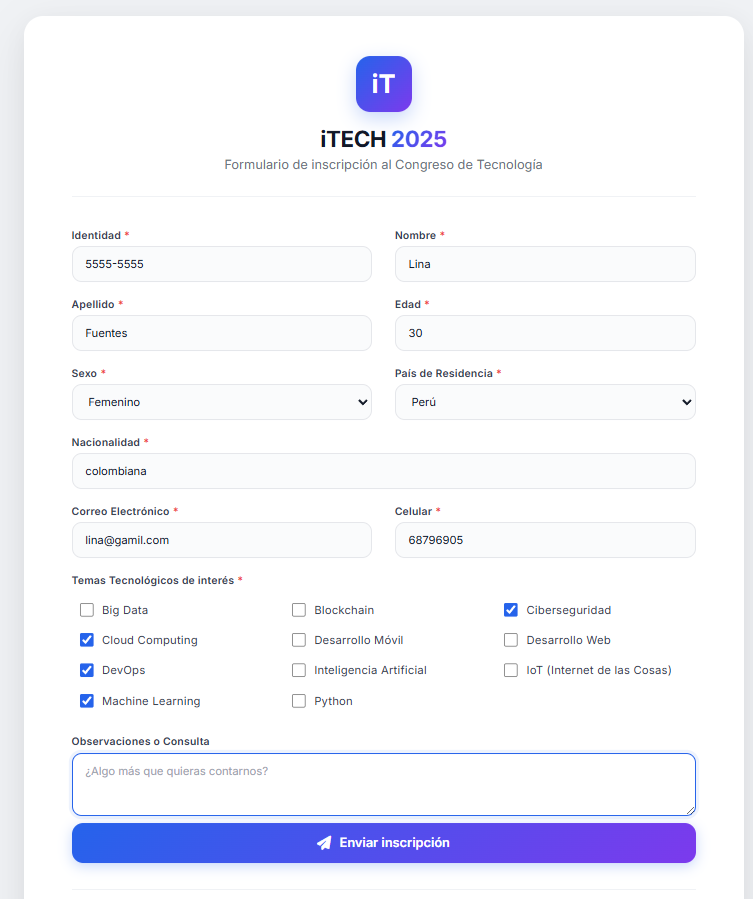
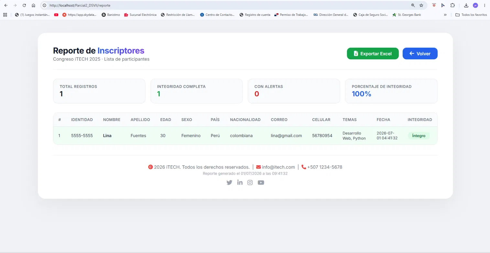
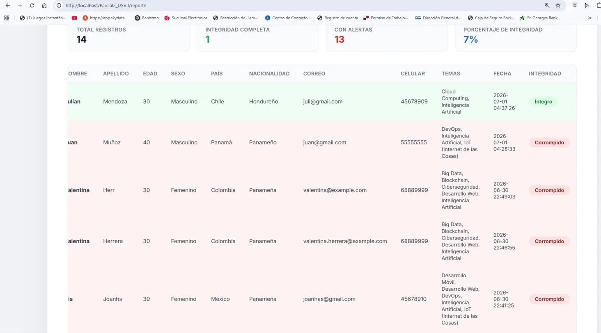

# iTECH 2025 - Sistema de Inscripción
## Parcial 2 - Desarrollo de Software VII · Arely Mendoza

[](https://www.php.net/)
[](https://www.mysql.com/)
[]()

> Sistema de inscripción para el Congreso de Tecnología iTECH 2025, desarrollado con PHP y MySQL bajo el patrón MVC.

---

## Tabla de Contenidos

- [Descripción](#descripción)
- [Características](#características)
- [Tecnologías Utilizadas](#tecnologías-utilizadas)
- [Estructura del Proyecto](#estructura-del-proyecto)
- [Requisitos](#requisitos)
- [Instalación](#instalación)
- [Base de Datos](#base-de-datos)
- [Uso](#uso)
- [Capturas de Pantalla](#capturas-de-pantalla)
- [Autora](#autora)

---

## Descripción

**iTECH 2025** es un sistema web de inscripción para el Congreso de Tecnología. Permite a los usuarios registrarse, seleccionar áreas de interés tecnológico y visualizar un reporte con todos los participantes. El sistema implementa validaciones de datos, sanitización, auditoría de integridad con firma digital OpenSSL y exportación a Excel.

### Objetivo

Gestionar de manera eficiente las inscripciones al congreso iTECH 2025, garantizando la integridad de los datos y brindando una experiencia de usuario profesional.

---

## Características

### Seguridad y Validación
- **Sanitización de datos** — clase estática (`Sanitizer`) que limpia todas las entradas del formulario.
- **Validación en PHP** — clase estática (`Validator`) que verifica cada campo antes de guardar.
- **Data Cleaning** — nombres y apellidos se guardan automáticamente en formato título.
- **Auditoría de integridad con OpenSSL** — cada inscripción se firma digitalmente (hash SHA-256 + firma RSA). El reporte verifica esa firma y marca cada registro como 🟢 íntegro o 🔴 corrompido si los datos fueron alterados directamente en la base de datos.

### Base de Datos
- **Estructura MVC** — organización profesional por responsabilidad (`config`, `models`, `views`, `controllers`, `utils`).
- **Llaves foráneas** — `ON DELETE RESTRICT` y `ON UPDATE CASCADE` en todas las relaciones.
- **Restricciones UNIQUE** — identidad y correo únicos por inscrito.
- **Validación de edad** — restringida entre 18 y 120 años.

### Reportes y Exportación
- **Reporte de participantes** — con temas de interés separados por comas.
- **Exportación a Excel** — descarga en un clic de todos los datos registrados.
- **Estadísticas en tiempo real** — total de inscritos, registros íntegros y porcentaje de integridad.

### Diseño
- **UI moderna** — diseño profesional con gradientes y sombras.
- **Responsive** — adaptable a distintos tamaños de pantalla.
- **Tipografía profesional** — Google Fonts (Inter).
- **Iconografía** — Font Awesome.

---

## Tecnologías Utilizadas

| Tecnología | Versión | Descripción |
|------------|---------|-------------|
| **PHP** | 8.3 | Lenguaje de programación backend |
| **MySQL** | 8.4 | Sistema de gestión de bases de datos |
| **Apache** | 2.4 | Servidor web (vía WAMP) |
| **WAMP** | 3.3+ | Entorno de desarrollo local |
| **PDO** | - | Conexión segura a la base de datos |
| **OpenSSL** | - | Firma digital y auditoría de integridad |
| **HTML5 / CSS3** | - | Estructura y estilos de las vistas |
| **Font Awesome** | 6.4.0 | Iconografía |
| **Google Fonts** | Inter | Tipografía |

---

## Estructura del Proyecto

```
Parcial2_DSVII/
├── app/
│   ├── config/
│   │   ├── database.php        # Clase de conexión (PDO, Singleton)
│   │   └── openssl.cnf         # Configuración OpenSSL para la firma digital
│   ├── controllers/
│   │   └── InscriptorController.php
│   ├── models/
│   │   ├── Inscriptor.php      # CRUD + firma digital al guardar
│   │   ├── Pais.php
│   │   └── Tema.php
│   ├── utils/
│   │   ├── Validator.php       # Validaciones (métodos estáticos)
│   │   ├── Sanitizer.php       # Sanitización (métodos estáticos)
│   │   └── Firmador.php        # Hash SHA-256 + firma/verificación OpenSSL
│   ├── views/
│   │   ├── formulario.php
│   │   └── reporte.php
│   └── Imagenes/
├── public/
│   └── index.php               # Punto de entrada de la aplicación
├── parcial_itech.sql           # Script de creación de la base de datos
├── index.php
├── .htaccess
└── README.md
```

---

## Requisitos

### Software necesario

| Software | Versión | Descarga |
|----------|---------|----------|
| **WAMP** | 3.3.0+ | [Descargar](https://www.wampserver.com/) |
| **PHP** | 8.0+ | Incluido en WAMP |
| **MySQL** | 8.0+ | Incluido en WAMP |
| **Navegador** | Moderno | Chrome, Firefox, Edge |

### Extensiones de PHP requeridas
- `pdo_mysql` — conexión a MySQL.
- `mysqli` — extensión de MySQL.
- `openssl` — generación de llaves y firma digital (requerido, no opcional).

---

## Instalación

1. **Clonar o descargar** este repositorio dentro de tu carpeta de servidor local:
   ```bash
   cd C:\wamp64\www
   git clone https://github.com/Arely200/Parcial2_DSVII.git
   ```

2. **Iniciar WAMP** y verificar que el ícono esté en verde (Apache y MySQL corriendo).

3. **Importar la base de datos** (ver sección [Base de Datos](#base-de-datos)).

4. **Abrir en el navegador:**
   ```
   http://localhost/Parcial2_DSVII/public/
   ```

La primera vez que alguien completa el formulario, el sistema genera automáticamente el par de llaves RSA usado para la firma digital (`app/config/llaves/`). Esa carpeta no se sube al repositorio (ver `.gitignore`) porque contiene la llave privada.

---

## Base de Datos

1. Abre `http://localhost/phpmyadmin/`.
2. Ve a la pestaña **Importar**.
3. Selecciona el archivo `parcial_itech.sql` de este repositorio.
4. Dale clic en **Continuar / Ejecutar**.

Esto crea la base de datos `parcial_itech` con las siguientes tablas:

| Tabla | Descripción |
|---|---|
| `paises` | Catálogo de países de residencia |
| `areas_interes` | Catálogo de temas tecnológicos |
| `inscriptores` | Datos de cada inscrito, incluyendo hash e firma digital |
| `inscriptor_temas` | Relación N:M entre inscritos y temas de interés |

Todas las llaves foráneas usan `ON DELETE RESTRICT ON UPDATE CASCADE`.

---

## Uso

1. **Inscribirse:** completa el formulario con tus datos personales y selecciona uno o más temas tecnológicos de interés.
2. **Ver el reporte:** después de enviar el formulario, el sistema te redirige automáticamente al reporte con todos los inscritos y su estado de integridad (🟢 / 🔴).
3. **Exportar a Excel:** desde el reporte, haz clic en el botón **Exportar a Excel** para descargar todos los datos en formato `.xls`.

---

## Capturas de Pantalla

**Formulario de Inscripción**
Formulario moderno y responsivo con todos los campos necesarios.


**Reporte de Participantes**
Reporte con estadísticas, auditoría de integridad y botón de exportación.

El sistema verifica la firma digital de cada inscrito y lo marca visualmente según su estado de integridad:

- 🟢 **Íntegro** — los datos del registro coinciden exactamente con el hash y la firma digital generados al momento de la inscripción. No han sido alterados.

 

- 🔴 **Corrompido** — el hash recalculado no coincide con la firma guardada, lo que indica que los datos fueron modificados directamente en la base de datos (por fuera del sistema) después de la inscripción, o que fueron firmados con una llave distinta a la actual.

  
---

## Autora

**Arely Mendoza**
Universidad Tecnológica de Panamá — Facultad de Ingeniería de Sistemas Computacionales
Ingeniería de Software VII